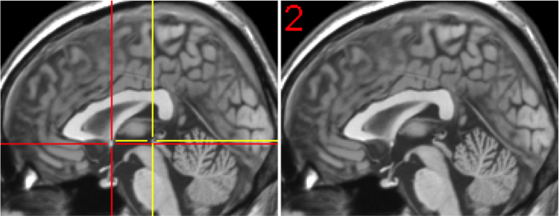

# Resting State Reorientation - No Scalp Data
- Protocol Developed by Kristen Stauffer
- Webpage Developed by Andie Bulbin

## The NO scalp resting state data includes the following imaging data files
-	Anatomical: eht1spgr
- Functional: trun's 1 – number of volumes 

## To open reorientation log
- Open “FF_Resting Folder”
- Open Resting State Tracking Log ([Example Log](https://docs.google.com/spreadsheets/d/e/2PACX-1vRNp9fz6cUquPPVvXn6UlMHFMGTzRChvB_7f9pFvpboLTt5sFeJ8ze4stBwyYLKMnogVi8Cds-xIkYn/pub?output=xlsx))
- Select No scalp reorientation sheet

## To open SPM12
1. Open Finder
1. Select Applications
1. Open matlab
1. In matlab type the following :
- $ addpath(genpath(‘PATH TO SPM12’))
- $ cd /PATH FOR IMAGING DATA DIRECTORY
- $ spm fmri

SPM 12 should automatically open 

## To open image and see origin
1. Click display in SPM  (*Note: spm is sensitive for clicking, only click once, . = forward, .. = back button)
1. Select ID
1. Click anatomy
1. Click t1spgr
1. Select eht1spgr
1. Click Done

Check to make sure this image has a does NOT have a scalp (if it DOES have a scalp hit display in SPM 12 and reselect eht1spgr)

**scalp**

**no scalp**

## To enter the reorientation coordinates
1. First you must click the crosshair position button labeled “Origin” to show where the current origin is. This should read mm: 0.0 0.0 0.0
1. Next enter the coordinates as listed in the “resting state tracking log” under right, forward, up, pitch, roll and yaw. 

## Check to make sure that the coordinates are in the correct position

### coronal view landmarks for alignment
- up/down: horizontal alighment with anterior comissure (this is the white matter just below the fornix)
- roll: longitudinal fissure should align with vertical cross hair

### transverse view landmarks for alignment
- right/left: vertical crosshair should align with longitudinal fissure
- yaw: longitudinal fissure should be straight with vertical cross hair
- forward/back: horizontal crosshair should be inline with anterior fissure (visible between lateral and third ventricles)

### sagittal view landmarks for alignment
- up/down: the crosshair should be on top of the anterior commissure
- pitch: the horizontal cross hair should intersect the posterior commissure

**AC in red, PC in yellow**

Credit: Chris Rorden (2002)

## What to do if coordinates are incorrect
- double check that you have selected the crosshair position button
- check to make sure you are using NO scalp coordinates
- in the resting tracking log, highlight the reorientation completed cell in yellow and write a note saying the coordinates were incorrect. *DO NOT COMPLETE REORIENTATION IF ORIGIN IS INCORRECT*

## How to apply the reorientation
1. Select reorient images
1. Select anatomy
1. Select file eht1spgr (you have now selected the anatomical scan). It should look like this - ex: structural = /PATH FOR IMAGING DATA/(participant ID)/connectivity/anatomy/eht1spgr_110sl.nii
1. Go back three times (.. button)
1. Select func
1. Select connectivity
1. Select run
1. Make range 1:300 in order to collect all scans, or large enough range to cover all data. *MAKE SURE TO SELECT ALL PRUN IMAGES*
1. Hit done and it will apply reorientation 
1. Display a random functional image to assure it was reoriented to acpc.
1. Once the reorientation is competed put an x in the reorientation completed column on the [tracking log](https://docs.google.com/spreadsheets/d/e/2PACX-1vRNp9fz6cUquPPVvXn6UlMHFMGTzRChvB_7f9pFvpboLTt5sFeJ8ze4stBwyYLKMnogVi8Cds-xIkYn/pub?output=xlsx)

#### References

Rorden, C. (2002, October 13). The Anterior Commissure. Retrieved November 15, 2017, from http://people.cas.sc.edu/rorden/anatomy/na_ac.html
